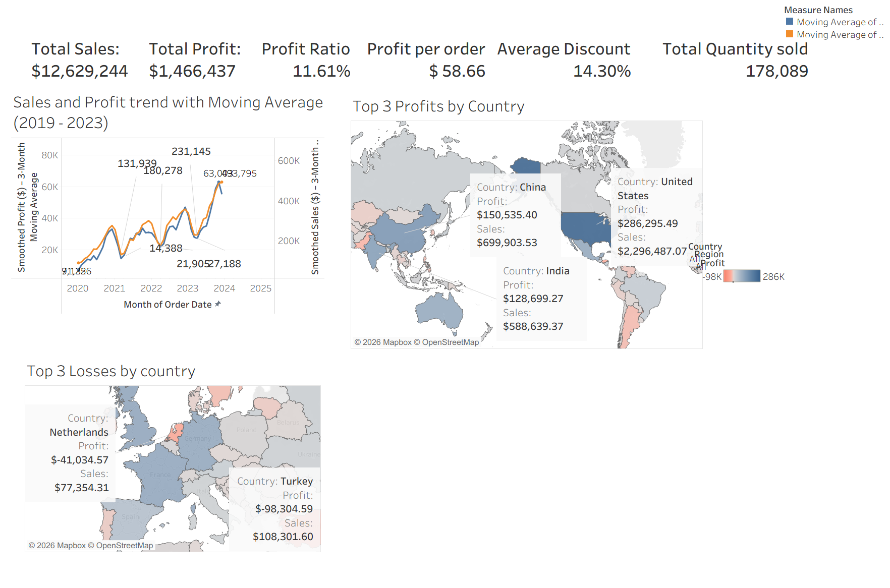
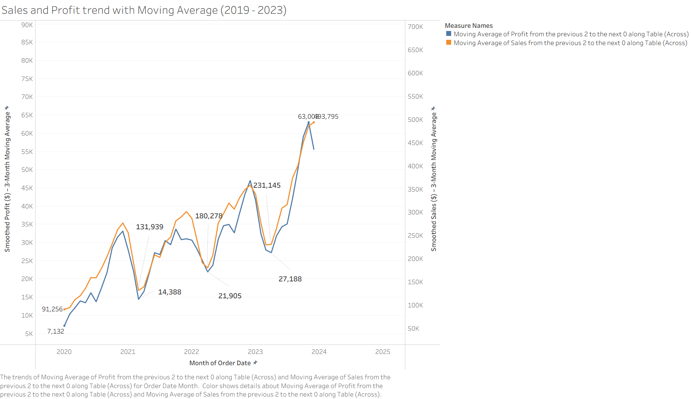
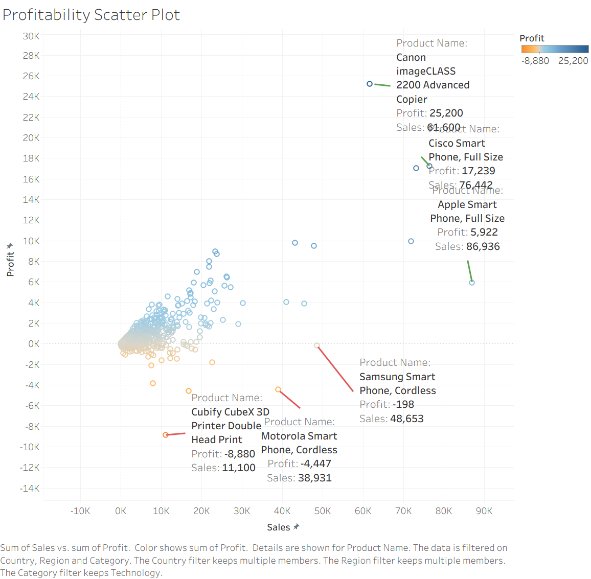
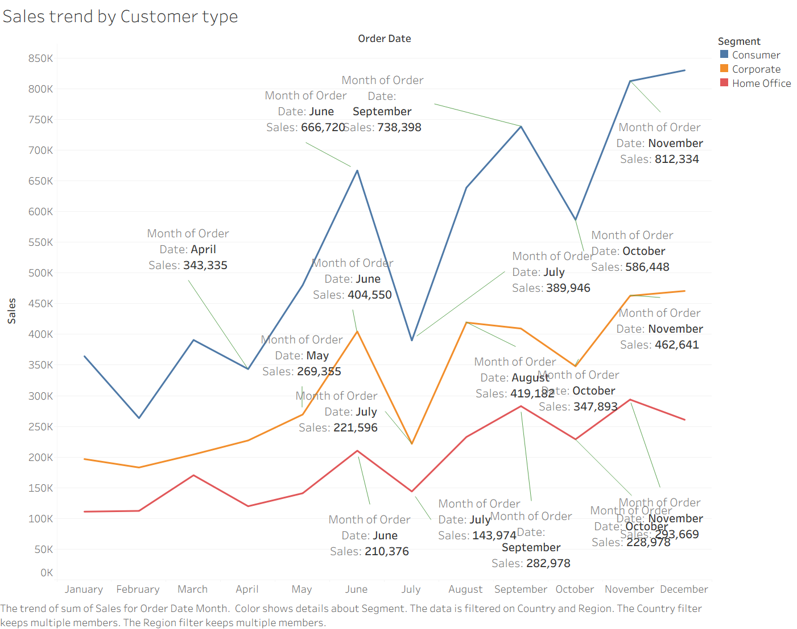
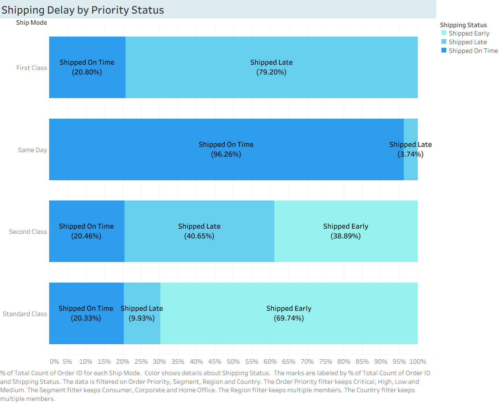
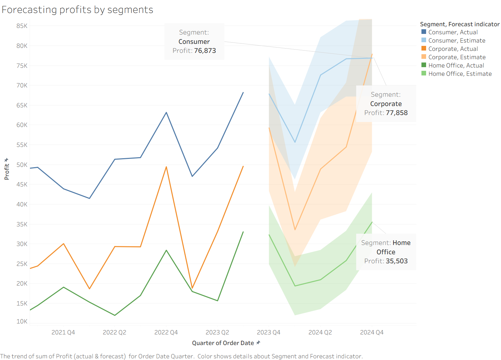

# 📊 Global Sales Business Intelligence Dashboard

An interactive Business Intelligence dashboard developed using **Tableau Desktop** to analyse global sales performance, customer behaviour, product profitability, shipping efficiency, and profit forecasting.

This project transforms transactional sales data into interactive dashboards that support business decision-making through data visualisation and analytics.

---

# Dashboard Overview



---

# Project Overview

The objective of this project is to provide business stakeholders with a comprehensive view of sales performance across multiple dimensions, including:

- Sales performance
- Profitability
- Customer behaviour
- Product performance
- Shipping efficiency
- Profit forecasting

The dashboard enables users to quickly identify trends, monitor key performance indicators (KPIs), and make data-driven business decisions.

---

# Key Performance Indicators (KPIs)

The dashboard highlights several important business metrics, including:

- 💰 Total Sales
- 💵 Total Profit
- 📈 Profit Ratio
- 📦 Profit per Order
- 🎯 Average Discount
- 📊 Total Quantity Sold

---

# Dashboard Features

## 📈 Sales & Profit Trend



Tracks monthly sales and profit using moving averages to identify long-term business trends and seasonality.

---

## 📊 Product Profitability Analysis



Identifies high-performing and underperforming products by comparing profitability against sales performance.

---

## 👥 Customer Analysis



Analyses customer purchasing behaviour across different customer segments to better understand buying patterns.

---

## 🚚 Shipping Analysis



Evaluates shipping performance and delivery efficiency to identify operational improvements.

---

## 🔮 Profit Forecast



Uses Tableau forecasting to estimate future profit trends and support strategic planning.

---

# Tools & Technologies

- Tableau Desktop
- Microsoft Excel
- Global Superstore Dataset

---

# Repository Structure

```text
global-sales-business-intelligence-dashboard/
│
├── Dashboard/
│   └── global_sales_business_intelligence_dashboard.twbx
│
├── Images/
│   ├── dashboard_overview.png
│   ├── sales_profit_trend.png
│   ├── profitability_scatter_plot.png
│   ├── customer_analysis.png
│   ├── shipping_analysis.png
│   └── profit_forecast.png
│
├── Report/
│   └── global_sales_business_intelligence_dashboard.pdf
│
├── LICENSE
└── README.md
```

---

# Dataset

This project uses the **Global Superstore** dataset, a publicly available dataset commonly used for Business Intelligence, Tableau, and data visualisation projects.

---

# Report

A detailed project report describing the dashboard design, methodology, analysis, and business recommendations is available in the **Report** folder.

---

# Tableau Workbook

The packaged Tableau workbook (`.twbx`) is included in the **Dashboard** folder and can be opened directly using Tableau Desktop or Tableau Public.

---

# Skills Demonstrated

This project demonstrates practical experience in:

- Business Intelligence
- Interactive Dashboard Design
- Data Visualisation
- KPI Reporting
- Customer Analytics
- Product Performance Analysis
- Sales Forecasting
- Business Storytelling

---

# Author

**Shahid Ishak**

BSc Data Science & Business Analytics

GitHub: https://github.com/shahidishak99
